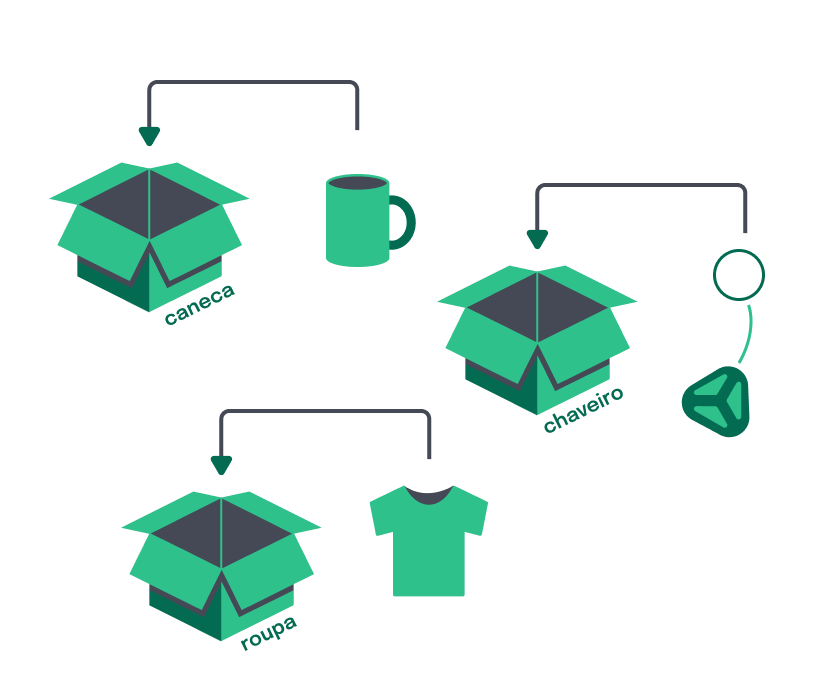

<p align="center">
  <a href="https://github.com/1fellype">
    
  </a>
  <h1 align="center">Guia Básico de JavaScript</h1>
</p>

</a>
<a href="https://www.linkedin.com/in/fellype-oliveira-920699230/" target="_blank">
  
</a>
<a href="https://github.com/1fellype/" target="_blank">
 
</a>
<a href="#" target="_blank">
 
</a>
</p>

> Tutorial baseado no curso Javascript do Zero da Instituição Trybe.
# Introdução
- O JavaScript foi criado em 1995, por Brendan Eich.
- Com o objetivo de deixar as páginas da web mais interativas e dinâmicas, pois até então elas só apresentavam conteúdo estático.
- Hoje, todos os navegadores têm suporte ao JavaScript e ele é o principal responsável pelas interações de pessoas usuárias com aplicações disponíveis na web.


---

## Variáveis e Constantes

Variáveis são como caixas que guardam informações na memória do computador e que podem ser utilizadas em todas as partes do programa.

Você provavelmente interage com sistemas que guardam informações nessas caixas:

- Seu nome de usuário quando faz o login no seu computador;
- O número da sua conta quando você acessa o sistema de um banco;

## O que são variáveis?

Variáveis são espaços na memória do computador que funcionam como caixas que possuem um nome e que podemos guardar alguma coisa dentro.



**Podemos imaginar variáveis exatamente dessa mesma forma**:

- A caixa é a variável, que possui uma etiqueta representando o nome da variável: roupa;
- O valor dessa variável é o que está dentro da caixa: camiseta.

Isso em código em JavaScript:

```jsx
let roupa = 'camiseta';
```

- A caixa representa a variável e a etiqueta `roupa` representa o nome dessa variável;
- A `'camiseta'`, representa o valor da variável.

Dessa maneira, é possível dizer que o valor `'camiseta'` foi atribuído à variável de nome `roupa`.

<aside>
💡 `let` é uma palavra-chave utilizada para declarar uma variável. Ela é colocada antes do nome da variável para informar ao computador que ela deve ser criada;

- `roupa` se refere ao nome da variável. Nesse caso, a caixa que representa a variável tem o nome `roupa`.
- `=`, é o operador de atribuição. Atribui o valor `'camiseta'` à variável `roupa`.
- `camiseta` é o valor atribuído à variável, ou seja, o produto que é colocado dentro da caixa. Nesse caso, o conteúdo da caixa é uma `'camiseta'`.
- Por fim, o ponto e vírgula `;` completa a estrutura. Esse sinal gráfico indica, na linguagem JavaScript, que você terminou de escrever aquela linha.
</aside>

As variáveis guardam somente um único valor por vez, que pode ser trocado por outro. Toda vez que for preciso colocar um novo valor dentro da variável, o anterior será substituído.

A palavra-chave é utilizada somente quando a variável é declarada, ou seja, quando você escreve ela no código pela primeira vez. Para reatribuir um valor à uma variável, a palavra-chave não deve ser repetida.

```jsx
roupa = 'moletom';
```

<aside>
💡 **Regras gerais para nomear variáveis ⚠️:**

- Não pode haver espaço entre as palavras;
- Não é possível começar o nome de uma variável com um número, mas é possível usar números em outras posições. Por exemplo: `1comida` não vai funcionar, mas `comida1` funciona.
- Nomes de variáveis são sensíveis a letras maiúsculas e minúsculas. Ou seja, `Comida` é diferente de `COMIDA` que é diferente de `comida`.
</aside>

<aside>
💡 **Convenção padrão**

Além dessas regras, existe uma convenção padrão para criação de nomes de variáveis em JavaScript chamada `camelCase`:

- As palavras são agrupadas em uma;
- O nome da variável começa com letra minúscula;
- Cada palavra nova começa com uma letra maiúscula, como acontece no próprio `camelCase`. Por exemplo: `carroVermelho`.
</aside>

## **Diferenças entre as palavras-chave**

- Existem três palavras-chave que você pode utilizar para declarar variáveis: var, let e const.
- As palavras-chave let e const foram introduzidas à linguagem JavaScript em 2015. Antes disso só era possível usar a palavra-chave var.

> Com o let você consegue declarar uma variável e reatribuir valor à ela:
> 

> O var tem praticamente as mesmas funcionalidades que o let e você também pode reatribuir valor à variável:
> 

```jsx
var meuNome = 'Maria';
meuNome = 'Aline';
console.log(meuNome);
```

> A const tem uma diferença:
> 

uma característica dessa palavra-chave é que ela é uma **constante**. Isto significa que, uma vez que essa variável é declarada, o valor dela não poderá ser alterado.

```jsx

const meuNome = 'Maria';
meuNome = 'Aline';
console.log(meuNome);
```

---

# Tipos primitivos

Ao utilizar computação para resolver problemas, é necessário representar informações da vida real, como números e textos. É para isso que os tipos primitivos servem, para que você consiga representar algo do mundo real em formato de código.

Em **JavaScript**, os tipos primitivos que você mais irá encontrar são os seguintes:

- string: sequências de caracteres, como palavras, textos, senhas, etc.;
- number: números, podendo ser positivos ou negativos, inteiros ou decimais;
- boolean: pode ser representado apenas pelos valores verdadeiro (`true`) ou falso (`false`).

**Veja alguns exemplos de dados desses tipos em código** JavaScript:

```jsx
1  let nome = 'Tryber'; // string
2  let idade = 19; // number
3  let aprovado = true; // boolean
```

Existem também alguns tipos que representam dados que possuem valores nulos ou valores indefinidos:

- `null`: é um valor atribuído como nulo, ou seja, é um valor vazio;
- `undefined`: não possui um valor, ou seja, é um dado que não foi definido

<aside>
💡 Existe um operador no JavaScript chamado `typeof`, que identifica o tipo de uma variável! **EX:** `console.log(typeof nome);`

</aside>

## Tipo string

Valores do tipo `string` são sequências de caracteres, escritos entre aspas simples (‘) ou duplas (“). Podem ser palavras, frases, textos inteiros, etc.

## Tipo number

Em JavaScript, o tipo `number` pode representar duas categorias de números:

- números inteiros, como `3`;
- números decimais, como `5.5`.

**Observe o exemplo:**

```jsx
let numero = 42;
 const pi = 3.14159265359;
```

## **Tipo boolean**

O tipo boolean, ou booleano em português, é um tipo que só pode assumir os valores verdadeiro ou falso. 

No contexto do **JavaScript**, o valor verdadeiro é `true`, e falso é `false`.

```jsx
let cadastroAtivo = true;
let habilitado = false;
```

## Tipo null

Em certas situações, precisamos lidar no código com variáveis que ainda não sabemos o valor que ela vai receber. 

Para isso, existe o valor `null`, que faz com que a variável tenha um valor nulo.

```jsx
let valorNulo = null;
```

## Tipo undefined

O tipo `undefined` é atribuído pelo **JavaScript** a variáveis que não possuem um valor ou que não foram declaradas, ou seja, são indefinidas. 

**Veja o exemplo abaixo:**

```jsx
let variavelSemValor;
console.log(typeof variavelSemValor); // undefined
```

<aside>
💡 De modo geral, não é desejável que haja variáveis desse tipo em um código. Normalmente, elas indicam que houve algum erro. Nos casos em que uma variável precisa ter seu valor vazio, a melhor prática é atribuir a ela o valor `null`.

</aside>


---

# Operações Aritméticas

Observe como podemos usar as quatro operações fundamentais (soma, subtração, multiplicação e divisão) em **JavaScript**:

```jsx
// Operação de soma:
2 + 2; // 4

// Operação de subtração:
10 - 2; // 8

// Operação de multiplicação:
4 * 3; // 12

// Operação de divisão:
12 / 6; // 2
```

> Os símbolos (`+`, `-`, `*`, e `/`) são o que chamamos de operadores aritméticos. Eles são utilizados para fazer operações com dois valores e produzir um novo valor único.
> 

Para definir uma operação como prioridade usamos os parênteses `()`. 

Dessa forma, pode-se mudar a operação para `(2 + 2 - 2) * 4 / 2`. Nesse caso, as operações de dentro dos parênteses (soma e subtração) serão calculadas primeiro, e só então o resultado é multiplicado por 4 e dividido por 2.

Dependendo dos operadores presentes em uma operação e do posicionamento deles, é possível chegar a diferentes resultados. **Por exemplo:**

```jsx
(2 + 2 - 2) * 4 / 2 // Retorna 4
(2 + 2 - 2) / 4 * 2 // Retorna 1
```

> Anota aí 📣 : na matemática existe um macete para saber a ordem de precedência das operações, o famoso ‘**PEMDAS**’:
> 


-

Outro operador que pode ser utilizado em JavaScript é o `**`, responsável por realizar operações de exponenciação. A exponenciação (ou potenciação) ocorre quando um dado número é multiplicado por ele mesmo, uma quantidade `n` de vezes. 

**Por exemplo:**

```jsx
2 ** 2 // Retorna 4
4 ** 3 // Retorna 64
```

## Operações de Módulo

A operação de módulo encontra o resto da divisão de um número por outro. 

É possível encontrar o módulo de uma divisão usando o operador de porcentagem (`%`). 

Por exemplo, o módulo de 4 divido por 2 é 0 (`4 % 2 = 0`), já o módulo de 4 divido por 3 é 1 (`4 % 3 = 1`).

**Em JavaScript:**

```jsx
2 % 2 // Retorna 0
7 % 3 // Retorna 1
5 % 3 // Retorna 2
```

## Usando operações para alterar valores

Quando uma operação é realizada, o valor retornado por essa operação geralmente é armazenado em uma variável para que possa ser usada em alguma lógica do código. 

Por exemplo, no código abaixo, o valor retornado pela operação de soma é salvo na variável `soma`. Assim, o valor da variável pode ser usado em qualquer lugar, basta chamar ela:

```jsx
let soma = 10 + 5;
console.log(soma); // Mostra o valor 15 no console
```

Valores salvos em variáveis também podem ser usados para fazer outras operações:

```jsx
let primeiroExemplo = 2 + 5 + 8;
console.log(primeiroExemplo); // 15

let segundoExemplo = 8 + 3 * 4;
console.log(segundoExemplo); // 20

let terceiroExemplo = (4 + 5 - 3) / 2;
console.log(terceiroExemplo ); // 3

let quartoExemplo = 2 ** 3;
console.log(quartoExemplo); // 8

let quintoExemplo = 10 % 7;
console.log(quintoExemplo); // 3

let meuUltimoExemplo = primeiroExemplo + segundoExemplo * (terceiroExemplo / quintoExemplo) - quartoExemplo;
console.log(meuUltimoExemplo ); // 27
```

Em **JavaScript**, é possível realizar operações com outros tipos de valores, como, por exemplo, `strings` e `booleans`:

```jsx
let hello = 'Hello';
hello = hello + ' ' + 'World';

console.log(hello); // "Hello World"

let somaBoolean = true + true;
console.log(somaBoolean); // 2
```

---

# **Operadores de Comparação**

**Comparar valores**

Quando desejamos obter o resultado da comparação entre dois valores, usamos pequenas expressões chamadas de Operadores de Comparação.

A estrutura de uma expressão desse tipo segue o seguinte formato ⬇️

```jsx
[valor] [operador de comparação] [valor]

Ex: 
7 < 10 // 7 é menor que 10 (verdadeiro), então retorna true.
7 > 10 // 7 é maior que 10 (falso), então retorna false.
```

Quando usamos esse formato de comparação, temos a possibilidade de tomar diferentes decisões ao longo do fluxo do programa. 

Os Operadores de Comparação não são usados somente no contexto de programação, provavelmente você já chegou a vê-los na Educação Básica. 

**Confira a função de cada um deles abaixo:**

- `===` para comparar estritamente a **igualdade** entre dois valores;
- `!==` para comparar estritamente a **diferença** entre dois valores;
- `>` para comparar se um valor é **maior** do que o outro;
- `<` para comparar se um valor é **menor** do que o outro;
- `>=` para comparar se um valor é **maior ou igual** do que o outro;
- `<=` para comparar se um valor é **menor ou igual** do que o outro.

## Operador ===

O operador `===`, chamado de “operador de igualdade estrita”, é utilizado para comparar dois valores. 

**Veja o exemplo abaixo:**

```jsx
const cidade = 'Belo Horizonte';
const verificaCidade = cidade === 'Belo Horizonte';

console.log(verificaCidade);
```

**Vamos analisar o código:**

- A variável `cidade` está recebendo o valor ‘Belo Horizonte’. Esse valor é uma `string` com ordem específica de caracteres;
- A variável `verificaCidade` está recebendo o resultado da comparação entre a variável `cidade` e a `string` ‘Belo Horizonte’, que retorna `true`, pois segue a mesma ordem de caracteres;

Se você executar o `console.log(verificaCidade)`, verá que o resultado no console será `true`.

<aside>
💡 **Anota aí 📣:** *O operador `===` só compara valores do mesmo tipo primitivo. Com isso, você deve comparar uma `string` somente com outra `string` e um `number` somente com outro `number`.*

</aside>

## Operador !==

É possível considerar o operador `!==` o oposto do operador `===`, ou seja, `!==` é diferença estrita e `===` é igualdade estrita.

> Você pode chamar o operador !== de **diferente de**. Além disso, esse operador leva em consideração o tipo primitivo dos valores, assim como o operador ===.
> 

**Exemplo**:

```jsx
const nomeDoCachorro = 'Pipoca';
const verificaNomeCachorro = nomeDoCachorro !== 'Pipoca'; // o valor da variável nomeDoCachorro é diferente de Pipoca?

console.log(verificaNomeCachorro); // false
```

**Vamos analisar:**

- A variável `verificaNomeCachorro` está recebendo o resultado da comparação entre o valor da variável `nomeDoCachorro` com o valor ‘Pipoca’. Com isso, temos a seguinte pergunta: O valor da variável `nomeDoCachorro` é diferente de ‘Pipoca’?

A resposta é: **não**, são valores iguais!

<aside>
💡 **Anota aí 📣:** *O operador `!==` verifica se os valores são* **diferentes***; desse modo, se um valor for* **diferente** *do outro, ele retorna `true`, e se for* **igual***, retornará `false`.*

</aside>

## Operador > e <

`>` É utilizado quando queremos verificar se um **valor é maior do que outro valor.** Observe o exemplo a seguir, que compara a idade de uma pessoa com a classificação indicativa de um filme

```jsx
const classificacaoIndicativa = 14;
const idadeDaPessoa = 15;
const verificaIdade = idadeDaPessoa > classificacaoIndicativa;

console.log(verificaIdade);
```

Na expressão acima, você está comparando se a `idadeDaPessoa` é maior do que `classificacaoIndicativa`, e o resultado é `true`, pois a classificação indicativa do filme é de 14 anos, e a `idadeDaPessoa` é 15 anos, ou seja, 15 é maior que 14.

Vamos agora para o operador `<`, que significa `menor que`. Sua função é verificar se um valor é `menor que` outro valor.

Vamos usar o exemplo anterior, mas dessa vez trocando os operadores. Observe:

```jsx
const classificacaoIndicativa = 14;
const idadeDaPessoa = 15;
const verificaIdade = idadeDaPessoa < classificacaoIndicativa;

console.log(verificaIdade);
```

Nessa nova expressão, você está perguntando: **“A idade da pessoa é menor do que a classificação indicativa?”**, e a resposta impressa pelo `console.log(verificaIdade);` será `false`, pois a pessoa tem 15 anos e a classificação indicativa do filme é 14 anos, ou seja, 15 não é menor que 14.

## Operador >= e <=

Quando queremos saber se “um valor é maior **ou** igual a outro valor”, podemos utilizar o operador `>=`.

**Ex:**

```jsx
const idadeDaPessoa = 18;
const idadeMaioridade = 18;
const verificaIdadeMaior = idadeDaPessoa > idadeMaioridade;
const verificaIdadeMaiorOuIgual = idadeDaPessoa >= idadeMaioridade;

console.log(verificaIdadeMaior);
console.log(verificaIdadeMaiorOuIgual);
```

Nesse exemplo, foram declaradas duas variáveis - `verificaIdadeMaior` e `verificaIdadeMaiorOuIgual` -, que recebem, cada uma, o resultado de uma expressão. Vamos analisá-las:

- A primeira utiliza o operador `>`;
- A segunda utiliza o operador `>=`;

As idades `idadeDaPessoa` e `idadeMaioridade` possuem o mesmo valor: 18.

A diferença entre os dois resultados é a seguinte:

- Na variável `verificaIdadeMaior`, o valor atribuído é `false`, porque a pergunta é “18 é maior do que 18?”
- Na variável `verificaIdadeMaiorOuIgual`, o valor atribuído é `true`, porque a pergunta é “18 é maior **ou** igual a 18?” e neste caso é igual.

Na expressão `idadeDaPessoa >= idadeMaioridade`, é possível dividi-la em duas perguntas menores e considerar que, se uma delas resultar em `true`, toda a expressão será considerada `true`.

O operador `<=`, chamado de `menor que`, funciona de maneira similar. 

Vamos aplicá-lo no mesmo exemplo e analisar o resultado:

```jsx
const idadeDaPessoa = 18;
const idadeMaioridade = 18;
const verificaIdade = idadeDaPessoa <= idadeMaioridade;

console.log(verificaIdade);
```

A expressão é: “A `idadeDaPessoa` é menor **ou** igual a `idadeMaioridade`?”. Caso uma delas seja avaliada como `true`, toda a expressão vai resultar em `true`.

> Anota aí 📣:Você vai utilizar o operador `>=` quando desejar comparar se **um valor é maior ou igual a outro valor;**
> 

> Você vai utilizar o operador `<=` quando desejar comparar se **um valor é menor ou igual a outro valor.**
> 

---

# Operadores Lógicos

Ao trabalhar com operadores lógicos, uma expressão terá apenas dois resultados: `verdadeiro` ou `falso`.

## **Operador AND - &&**

<aside>
💡 Imagine que um amigo seu, aqui chamado de Vinicius, quer passar o dia na praia. Ele trabalha e estuda nos dias de semana e, além disso, Vinicius só vai à praia quando está sol.

</aside>

O operador `AND` servirá para fazer a comparação de cenários, e nos retornar o resultado correto. 

Esse operador é representado pela sintaxe `&&`. Vamos testar com código e definir as variáveis utilizadas:

```jsx
let ensolarado = false;
let fimDeSemana = true;
let vaiAPraia;
```

Com as variáveis definidas, podemos usar o operador `&&` (AND).

```jsx
let vaiAPraia = ensolarado && fimDeSemana
console.log(vaiAPraia); // false
```

Como observamos no exemplo, Vinicius ainda não pode ir à praia, pois o dia não está ensolarado. Será que, se mudarmos a variável `ensolarado`, isso irá resolver o problema de Vinicius?

```jsx
let ensolarado = true;
console.log(vaiAPraia); // true
```

## Operador OR - II

<aside>
💡 Onde Vinicius mora não há transporte público que faça o percurso até a praia. Dessa forma, é necessário ir de carro, e ele deverá cumprir um dos critérios:

- O carro ter gasolina;
- Ele ter dinheiro para abastecer.
</aside>

Em código, podemos usar essa mesma lógica, por meio do nosso operador `OR` representado pela sintaxe `||`. Agora veja como está a situação do Vinicius e se ele pode ir à praia:

```jsx
let gasolina = true;
let dinheiro = false;
let vaiAPraia = gasolina || dinheiro;
console.log(vaiAPraia); // true
```

Mas vamos supor que o tanque de gasolina está vazando e Vinicius tenha perdido toda a gasolina. O que aconteceria com o código?

```jsx
let gasolina = false;
console.log(vaiAPraia); // false
```

## Operador NOT - !

<aside>
💡 Será que Vinicius verificou se o carro estava quebrado?

</aside>


Vamos ver como ocorre essa situação em código?

- `carroQuebrado` seria a variável;
- A variável `vaiAPraia` seria o oposto de `carroQuebrado`, pois ela necessita que o carro não esteja quebrado.

Para isso, você pode utilizar o operador `NOT` representado pela sintaxe `!`.

```jsx
let carroQuebrado = true;
let vaiAPraia = !carroQuebrado;
console.log(vaiAPraia); // false
```

Bom, se o carro do Vinicius está consertado, ele pode ir à praia.

```jsx
carroQuebrado = false;
console.log(vaiAPraia); // true
```

---

# Estrutura Condicional

## If

Imagine então que você precisa sair de casa e, se estiver frio, você pega um casaco; se não, você deixa o casaco em casa.


**Em JavaScript**:

```jsx
let frio = 'está';

if (frio == 'está') { // se estiver frio, nossa condição será true
	console.log('saia com casaco'); // então execute o código
} 

else {
console.log('está calor')
}
```

<aside>
💡 - Dentro dos parênteses do `if` é fornecida uma condição que é avaliada como `true` ou `false`.

- Se a condição retorna verdadeiro (`true`), o código dentro das chaves `{}` é executado.

</aside>

## Else

O `else` é o complemento do `if` e que, traduzido para o português, seria como dizer `se` e `senão`.

<aside>
💡 Sempre que a condição do `if` não for verdadeira, ou seja, retornar falso, o `else` entra em ação e o código dentro do seu escopo será executado.

</aside>

Assim como no `if`, o `else` também tem escopo próprio, logo, as regras que se aplicam ao `if` também são aplicadas ao `else`.

## Encadeamento de Condicionais

Para entender o `else if`, vamos supor que você gosta muito de vitamina de abacate e de banana, mas quando não tem nenhuma dessas duas frutas em casa, você faz vitamina da fruta que estiver disponível. 

**Então você tem a seguinte estrutura condicional para fazer a vitamina:**

- `Se` a fruta for `abacate`, podemos fazer uma `vitamina de abacate`;
- `Se não, se` a fruta for `banana`, podemos fazer uma `vitamina de banana`;
- `Se não` for nenhuma dessas duas, podemos fazer um `suco da fruta que temos disponível`.

**Abaixo temos essa estrutura de condição em formato de código:**

```jsx
const frutaDisponivel = 'banana';

if (frutaDisponivel === 'abacate') {
  console.log('Vitamina de abacate saindo');
} 

	else if (frutaDisponivel === 'banana') {
  console.log('Vitamina de banana saindo');
	} 

	else {
  console.log('Suco de ' + frutaDisponivel + ' saindo');
	}
```

<aside>
💡 Você pode adicionar quantos `else if` forem necessários em uma mesma estrutura condicional.

</aside>

**Veja esse exemplo em que também foi aplicado o `else/if`:**

A estrutura condicional abaixo representa o sistema de notas da escola **Trybe**:

```jsx
const notaDaPessoaEstudante = 7.5;

if (notaDaPessoaEstudante >= 8) {
  console.log('Nota A');
} 
	
	else if (notaDaPessoaEstudante >= 6 && notaDaPessoaEstudante < 8 ) {
  console.log('Nota B');
} 
	
	else if (notaDaPessoaEstudante >= 4 && notaDaPessoaEstudante < 6 ) {
  console.log('Nota C');
} 
	
	else {
  console.log('Nota D');
}
```

---

# Pensamento Computacional

Os problemas farão parte da sua vida como pessoa desenvolvedora, e adotar uma abordagem de resolução de problemas vai te ajudar muito a encontrar soluções. O Pensamento Computacional é uma maneira de lidar com problemas complexos, dividindo a solução em instruções que um computador pode seguir.

Na área de desenvolvimento de software, é uma boa prática usar o Pensamento Computacional ao implementar `código` para desenvolver um programa; o interessante é que essa estratégia pode ser útil para qualquer pessoa, e pode ser aplicada na maioria dos problemas.

**Para resolver o problema usando a estratégia do Pensamento Computacional, siga:**

- Analise o problema e o divida em partes menores;
- Resolva cada parte de modo isolado;
- Chegue a uma sequência de passos que, se seguidos, te dão a solução para o problema maior.

## Pensamento computacional aplicado à programação

Antes de começar, de fato, a escrever o código, é uma boa prática você ter um plano de ação para resolver um problema. A partir da definição do que seu código deve fazer e das condições que o problema apresenta, fica mais fácil chegar a uma sequência de instruções para a solução.

Para começar, separe o problema principal em partes menores. Para este problema, comece separando as informações que são úteis e devem ser consideradas.

Em um primeiro momento, um problema pode parecer complexo somente pela descrição. Mas, ao utilizar o Pensamento Computacional para separar as informações importantes, quebrar o seu problema em partes menores, encontrando semelhanças entre as soluções das partes, como por exemplo: verificação do `nome` e `cargo`, você testou hipóteses e solucionou cada uma delas.

---

# Arrays

Pode parecer um sonho, mas é possível termos variáveis que guardam mais de um valor utilizando listas! Em JavaScript essas listas são conhecidas como `arrays`

<aside>
💡 Na prática, imagine que você está desenvolvendo um programa responsável pela exibição da sua lista de compras da semana. Seria muito trabalhoso salvar cada item dentro de variáveis diferentes, não é? É para isso que existem os `arrays`! Eles são **basicamente listas que armazenam valores.**

</aside>

### Variáveis compostas

As variáveis em **JavaScript**, chamadas de **variável simples**, são utilizadas para armazenar apenas um valor.

Para armazenar **mais de um** valor por vez basta usar as **variáveis compostas**! 

Imagine que uma escola te contratou para a criação de um programa, o qual devesse retornar uma **lista** com os nomes de todas as pessoas estudantes de cada turma. Você até poderia criar uma variável por pessoa, mas, além de a escola ter muitas pessoas estudantes, o prazo é curto. Além disso, utilizando a **variável simples** para a resolução desse problema, o **código** ficaria muito grande e poderia se tornar confuso.

Para resolver isso devemos utilizar **arrays**, já que funciona como um tipo de **variável composta.**  

```jsx
// exemplo com variáveis simples
const turma1estudante1 = 'Fàbio';
const turma1estudante2 = 'Cristina';
const turma1estudante3 = 'Jéssica';
const turma2estudante1 = 'João';
const turma2estudante2 = 'Diogo';

//exemplo com variáveis compostas
const alunosTurma1 = ['Fàbio', 'Cristina', 'Jéssica'];
const alunosTurma2 = ['João', 'Diogo'];

console.log(alunosTurma1); // ['Fàbio', 'Cristina', 'Jéssica']
console.log(alunosTurma2); // ['João', 'Diogo']
```

**Arrays** também armazenam outros tipos de dados como number.

```jsx
// Ex: você decidiu desenvolver um programa que simula um jogo de loteria, 
// e precisa guardar os números sorteados para compará-los com os 
// números escolhidos pela pessoa usuária. 

const numerosSorteados = [39, 7, 2, 21, 6, 26];
console.log(numerosSorteados); // [39, 7, 2, 21, 6, 26]
```

### **Acessando um valor da lista pelo seu índice**

Para descobrir um **item específico** de um **array** podemos encontrar a posição que esse item ocupa com o exemplo: `meuArray[posiçãoQueEuQuero].`

A posição de um item no **array** é chamada de **índice** ou, em inglês, **index**.

<aside>
💡 O **índice** inicia a partir do **0** e, para acessar a posição de um item no **array**, usamos a estrutura meuArray[indiceQueEuQuero].

</aside>

```jsx
// Imagine que você chegou em uma pizzaria e optou por alguns sabores 
// que gostaria de provar. Para não esquecer suas escolhas, 
// você resolveu guardar em uma lista:

const pizzas = ['4 queijos', 'frango com catupiry', 'alho', 'chocolate', 'pepperoni'];
```


```jsx
// Como o índice começa a partir do 0, significa que o sabor 
// frango com catupiry está no índice 1. 
// Para conseguirmos a pizza com o sabor que queremos primeiro, 
// seguimos conforme o exemplo:

const pizzas = ['4 queijos', 'frango com catupiry', 'alho', 'chocolate', 'pepperoni'];
const pizzaEscolhida = pizzas[1];

console.log(pizzaEscolhida); // frango com catupiry
```

### **Adicionando um valor a um array**

**Pense no seguinte cenário**: você precisa ir ao mercado e fez uma lista de compras com JavaScript, utilizando um `array` para armazenar os itens da lista:

```jsx
const listaDeCompras = ['arroz', 'feijão', 'ovo'];

// Porém, esqueceu de adicionar o item 'farofa' e não pode 
// adicioná-lo diretamente no seu array. 
// O que fazer agora?

// Para isso, você tem duas opções:
	// Usar o próximo índice disponível;
	// Utilizar a função .push(), um método próprio para adicionar 
		// um item no array.

// Primeiro, vamos testar usando o próximo índice disponível:
const listaDeCompras = ['arroz', 'feijão', 'ovo'];
listaCompras[3] = 'farofa';

console.log(listaDeCompras); // ['arroz', 'feijão', 'ovo', 'farofa']
```

Nossa lista é pequena e conseguimos contar cada item, mas e se a lista fosse maior? 

Ficaria difícil saber qual é o último item do **array**. Para isso, podemos utilizar o **.push()**, que vai adicionar um valor ao final do **array**. 

Seu formato é: **meuArray.push(valor);**.

```jsx
const listaCompras = ['arroz', 'feijão', 'ovo'];
listaCompras.push('farofa')
console.log(listaCompras); // ['arroz', 'feijão', 'ovo', 'farofa']
```

### Substituindo um item em um array

**Pense no seguinte cenário**: Imagine que você precisa fazer um programa que analise o clima da região Norte e, para realizar essa tarefa, criou uma **lista** para **armazenar** os estados da região, mas, ao invés de adicionar o ‘Pará’, você sem querer adicionou o ‘Paraná’, que é da região Sul:

```jsx
const estadosNorte = ['Acre', 'Amapá', 'Amazonas', 'Paraná', 'Rondônia', 'Roraima', 'Tocantins'];
```

Para resolver isso, você precisa descobrir o **índice** do item que você quer **substituir**:

```jsx
const estadosNorte = ['Acre', 'Amapá', 'Amazonas', 'Paraná', 'Rondônia', 'Roraima', 'Tocantins'];
console.log(estadosNorte[3]); // Paraná
```

Segundo, com o **índice** em mãos, basta **atribuir** o novo valor nele, no formato **meuArray[meuIndiceJaOcupado] = valor**.

```jsx
const estadosNorte = ['Acre', 'Amapá', 'Amazonas', 'Paraná', 'Rondônia', 'Roraima', 'Tocantins'];
estadosNorte[3] = 'Pará';

console.log(estadosNorte); // 'Acre', 'Amapá', 'Amazonas', 'Pará', 'Rondônia', 'Roraima', 'Tocantins'
```

### **Recuperando o tamanho de um array**

**Pense no seguinte cenário**: Você decidiu fazer uma festa, entretanto acabou se perdendo na **quantidade** de pessoas que estão na lista de convidados, afinal sempre tem pessoas confirmando ou cancelando a participação no evento. 

Você precisa saber a quantidade de pessoas que farão parte da festa para decidir o local adequado. E agora, como **solucionar** esse problema?

Para descobrir essa informação, basta olhar a **quantidade de itens** da lista, ou seja, o **tamanho** dela.

Existe uma função no **JavaScript** que já faz isso para a nós: a **.length**.

Seguindo o exemplo da lista de convidados, veja o **código** abaixo:

```jsx
const convidados = ['Sheila', 'Cleyton', 'Leticia', 'Gisele', 'Vinicius', 'Ivan', 'Laura', 'Guilherme', 'Erickson', 'Claudio', 'Adilson', 'Juliana'];
const quantidadeConvidados = convidados.length;

console.log(convidados); // ['Sheila', 'Cleyton', 'Leticia', 'Gisele', 'Vinicius', 'Ivan', 'Laura', 'Guilherme', 'Erickson', 'Claudio', 'Adilson', 'Juliana']
console.log(quantidadeConvidados); // 12

// Se adicionarmos um valor a essa lista, ela mudaria de tamanho? 
// Com toda certeza. Veja o código a seguir

const convidados = ['Sheila', 'Cleyton', 'Leticia', 'Gisele', 'Vinicius', 'Ivan', 'Laura', 'Guilherme', 'Erickson', 'Claudio', 'Adilson', 'Juliana'];
convidados.push('Evelyn');

console.log(convidados.length); // 13
```

Agora temos a **Evelyn** na nossa lista de convidados e o **array** possui 13 pessoas no momento.

<aside>
💡 Com o **.length**, também podemos descobrir qual é o último valor da lista, sem precisar de **índice**!

</aside>

- Temos 13 convidados na nossa lista. Podemos verificar com **convidados.length.**
- Sabemos que o índice começa do **0**, ou seja, se temos 13 itens, significa que o último índice é **13 - 1**, no caso, **12**. Podemos verificar com **convidados.length - 1.**
- Então, para pegarmos o último valor da lista, ficaria da seguinte forma: **meuArray[meuArray.length - 1]**.


Ou seja, como o **índice do último item** sempre é **1 número a menos** que o **comprimento total** dessa lista, a única coisa que precisamos fazer é subtrair 1 da quantidade total de itens do **array**.

```jsx
// Ex
const convidados = ['Sheila', 'Cleyton', 'Leticia', 'Gisele', 'Vinicius', 'Ivan', 'Laura', 'Guilherme', 'Erickson', 'Claudio', 'Adilson', 'Juliana', 'Evelyn'];
const ultimoConvidado = convidados[convidados.length - 1];

console.log(ultimoConvidado); // Evelyn
```

---

# Estrutura de repetição for

Em algum momento você pode precisar **repetir** um mesmo passo **várias vezes**. 

Por exemplo, no ano novo existe a tradição de fazer uma contagem regressiva na espera da virada. Para fazer uma contagem regressiva em código, com as ferramentas que você tem até agora, o código ficaria mais ou menos assim:

```jsx
console.log(10);
console.log(9);
console.log(8);
console.log(7);
console.log(6);
console.log(5);
console.log(4);
console.log(3);
console.log(2);
console.log(1);
console.log('UHULLLLLLLLLLLLLLLLLLLL FELIZ ANO NOVOOOOOOOO 🍾🎆🎆✨');
```

O `for` serve para solucionar esse problema! Ele é um **laço de repetição** (também chamado de **loop**) que vai realizar diversas vezes o **conjunto de instruções** que estiver dentro dele, até que uma **condição** especificada seja atendida. 

**Seu formato é o seguinte:**

```jsx
for (expressão inicial; condição a ser cumprida; 
		atualização da expressão inicial) {
    // código que será repetido
}
```

**Você pode decompor o problema da contagem regressiva em partes menores para montar o `for`**

**Agora que o problema foi decomposto, você vai aplicá-lo em código, seguindo o passo a passo:**

<aside>
💡 **Relembrando 🧠** : Se você declarar a variável utilizando **const**, ela não poderá ser alterada e o seu **for** não vai funcionar da forma esperada.

</aside>

```jsx
for (let index = 10; condição a ser cumprida; atualização da expressão inicial) {
    // código que será repetido
}

for (let index = 10; index >= 1; atualização da expressão inicial) {
  // código que será repetido
}

for (let index = 10; index >= 1; index = index - 1) {
  // código que será repetido
}

// O for está montado! Só falta colocar o código que você deseja repetir. 
// Nesse caso, você vai fazer um console.log do index:
for (let index = 10; index >= 1; index = index - 1) {
  console.log(index);
}

// Mas agora que você terminou a contagem, temos que estourar o champagne
for (let index = 10; index >= 1; index = index - 1) {
  console.log(index);
}

console.log('UHULLLLLLLLLLLLLLLLLLLL FELIZ ANO NOVOOOOOOOO 🍾🎆🎆✨');
```


<aside>
💡 O `for` funciona da seguinte forma.

</aside>

## **Utilizando duas estruturas de repetição `for` aninhadas**

Você já entrou no perfil de uma pessoa na rede social e viu que vocês possuem **amizades em comum?** Suponha que você precise desenvolver um recurso com essa mesma finalidade para uma empresa. Como você faria?

**• Primeiro:** Simule as listas de amizades de duas pessoas para poder realizar as comparações.

```jsx
const amizadesDaJuliana = ['Erickson', 'Cleyton', 'Laura', 'Claudio', 'Sheila', 'Vinicius', 'Leticia'];
const amizadesDoAdilson = ['Leticia', 'Guilherme', 'Cleyton', 'Ivan', 'Vinicius', 'Gisele'];
const amizadesEmComum = [];
```

**• Segundo:** Percorra o primeiro `array` (`amizadesDaJuliana`) para conseguir realizar as comparações. Você irá dar um `console.log` para verificar que está percorrendo o `array` corretamente.

```jsx
const amizadesDaJuliana = ['Erickson', 'Cleyton', 'Laura', 'Claudio', 'Sheila', 'Vinicius', 'Leticia'];
const amizadesDoAdilson = ['Leticia', 'Guilherme', 'Cleyton', 'Ivan', 'Vinicius', 'Gisele'];
const amizadesEmComum = [];

for (let indexDaJuliana = 0; indexDaJuliana < amizadesDaJuliana.length; indexDaJuliana = indexDaJuliana + 1) {
  console.log(amizadesDaJuliana[indexDaJuliana]);
}
```

- **Terceiro:** Neste momento, você já está percorrendo o primeiro `array` (`amizadesDaJuliana`). Agora precisa percorrer também o segundo `array` (`amizadesDoAdilson`).

**Atenção ⚠️:** Você precisa realizar as comparações entre os `amizadesDaJuliana` e os `amizadesDoAdilson`. Para que isso seja feito, é necessário que o segundo `for` esteja dentro do primeiro. Você irá pegar **um** amigo da Juliana e comparar com todas as amizades do Adilson em **cada repetição** do primeiro `for`.

```jsx
const amizadesDaJuliana = ['Erickson', 'Cleyton', 'Laura', 'Claudio', 'Sheila', 'Vinicius', 'Leticia'];
const amizadesDoAdilson = ['Leticia', 'Guilherme', 'Cleyton', 'Ivan', 'Vinicius', 'Gisele'];
const amizadesEmComum = [];

for (let indexDaJuliana = 0; indexDaJuliana < amizadesDaJuliana.length; indexDaJuliana = indexDaJuliana + 1) {
  console.log('Pessoa Amiga da Juliana');
  console.log(amizadesDaJuliana[indexDaJuliana]);
  for (let indexDoAdilson = 0; indexDoAdilson < amizadesDoAdilson.length; indexDoAdilson = indexDoAdilson + 1) {
    console.log('Pessoa amiga do Adilson: ' + amizadesDoAdilson[indexDoAdilson]);
  }
}
```

Note que, a cada iteração do primeiro `for`, o segundo `for` percorre cada elemento do `array` `amizadesDoAdilson`.

Com isso, você pode realizar a comparação dos `amizadesDaJuliana` com os `amizadesDoAdilson`, já que para cada pessoa amiga da Juliana você percorre todas as pessoas amigas do Adilson, podendo comparar um a um e verificar se eles são **iguais**. Caso sejam iguais, você irá armazenar essa pessoa amiga na lista `amizadesEmComum`.

```jsx
// Não se esqueça de utilizar o console.log() na variável 
// amizadesEmComum para verificar se tudo deu certo mesmo

const amizadesDaJuliana = ['Erickson', 'Cleyton', 'Laura', 'Claudio', 'Sheila', 'Vinicius', 'Leticia'];
const amizadesDoAdilson = ['Leticia', 'Guilherme', 'Cleyton', 'Ivan', 'Vinicius', 'Gisele'];
const amizadesEmComum = [];

for (let indexDaJuliana = 0; indexDaJuliana < amizadesDaJuliana.length; indexDaJuliana = indexDaJuliana + 1) {
  for (let indexDoAdilson = 0; indexDoAdilson < amizadesDoAdilson.length; indexDoAdilson = indexDoAdilson + 1) {
    if (amizadesDaJuliana[indexDaJuliana] === amizadesDoAdilson[indexDoAdilson]){
      amizadesEmComum.push(amizadesDoAdilson[indexDoAdilson]);
    }
  }
}

console.log(amizadesEmComum);
```

Veja como o `for` acontece com esse gif:


---

# Funções

**Funções**, na **programação**, são **blocos de código**s que executam uma **ação necessária** em **vários momentos diferentes**, e podem receber e retornar informações.

**Por exemplo**, para muitas pessoas a **tarefa de lavar louça é diária.** Para realizá-la, temos uma **sequência de passos** que **inclui**: esfregar os pratos, os copos, os talheres, as panelas, etc.

Suponha que você precisa **repetir** esse passo a passo todos os dias e, às vezes, mais de uma vez por dia. É cansativo, né? 

Se você tem uma **lavadora de louças**, é só colocar tudo dentro dela, esperar o ciclo de lavagem terminar e, no final, ela te entrega todas as louças limpas! Muito melhor, não é mesmo?


As **funções** são como a **lavadora de louças!** Em vez de **repetir muitas vezes** o mesmo **código**, **utilizamos as funções sempre que é necessário executar a mesma tarefa novamente.** Essa é a praticidade que as funções te proporcionam na programação!

A **definição da função (também chamada de declaração da função)** consiste no uso da palavra-chave `function`, seguida pelo nome da função e parênteses `()`. A ação estará nos blocos de código que definem o corpo da função, entre chaves `{}`. 

**Veja como isso ocorre na prática:**

```jsx
function nomeDaFuncao() {
  // bloco de código a ser executado
}
```

```jsx
// Por exemplo, se você fosse desenvolver uma função que tivesse o 
// objetivo de cumprimentar a pessoa que está executando o programa  
// pelo nome, tal como ‘Olá, Gisele!’, como você faria?

function imprimeSaudacao() {
  return 'Olá Gisele!';
}

// agora invoque a função 
imprimeSaudacao();
```

## Parâmetros

**Parâmetros** **são informações - ou argumentos -** passados para as **funções** com o objetivo deixar seu **código** mais **dinâmico e organizado**. É possível criar funções com nenhum ou vários parâmetros.

Para decidir se é necessário utilizar **parâmetros**, você vai depender do objetivo da sua função. 

**Por exemplo**, se você desenvolver uma função com o objetivo de dar ‘Bom dia!’, o parâmetro não é necessário, porque essa informação não precisa ser alterada. 

Mas se você quer cumprimentar a pessoa que está executando o programa pelo nome, como a **função** `imprimeSaudacao` que retorna o texto `'Olá, Gisele!'`, é necessário que o nome recebido seja dinâmico, ou seja, é preciso que sua função receba um parâmetro que possibilite que o nome seja alterado.

**Observe o código abaixo para ver como isso ocorrendo na prática:**

```jsx
function imprimeSaudacao(nome) {
  const saudacao = 'Olá, ' + nome + '!';
  return saudacao;
}

console.log(imprimeSaudacao('Gisele'));
```

As **funções** podem receber mais de um **parâmetro** e, para fazer isso, **basta separá-los por vírgula na declaração** e na hora de chamar a função. Veja o exemplo abaixo:

```jsx
function imprimeSaudacao(nome, sobrenome) {
  const saudacao = 'Olá, ' + nome + ' ' + sobrenome + '!';
  return saudacao;
}

console.log(imprimeSaudacao('Gisele', 'Santin'));
```

